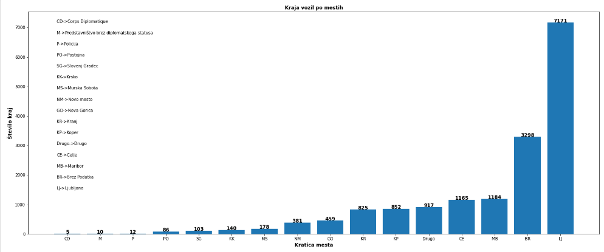
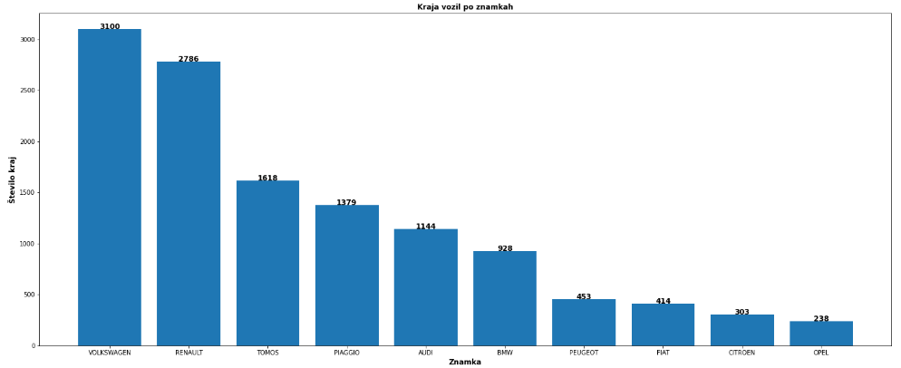
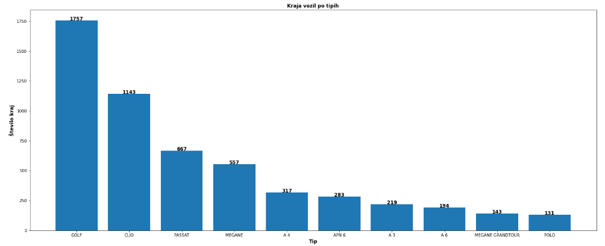
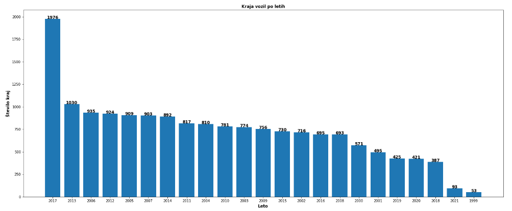
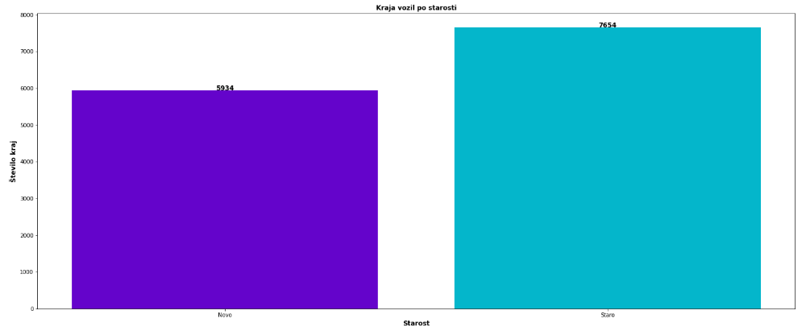
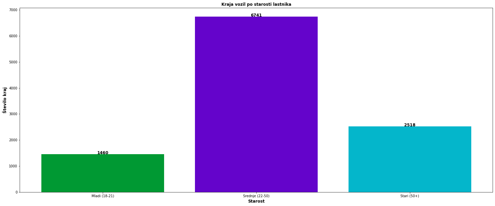
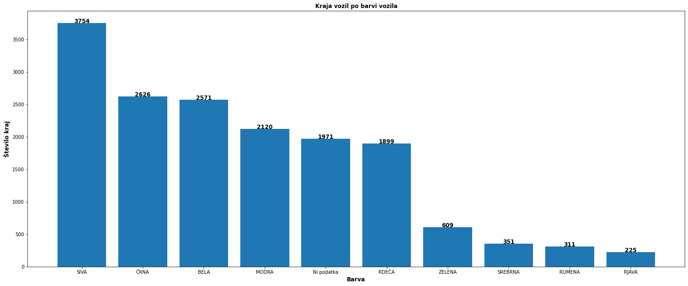

# Vmesno poročilo za seminarsko nalogo Podatkovno Rudarjenje.

## UVOD:
Za tematiko smo si izbrali ukradena vozila. Tematika se nam je zdela zanimiva glede na to, da smo lahko dobili več informacij iz spletne strain autolog, kjer smo tudi videli neke informacije o lastniku.

Za začetek smo prenesli vse podatke o ukradenih vozilih. Na uradni spletni strani policije o ukradenih vozilih je prenos možen v večih oblikah. Mi smo si izbrali txt datoteko, katero smo nato pretvorili v csv, poleg txt oblike pa smo lahko prenesli tudi datoteko v Json obliki.
Naredili smo nekaj poizvedb, zgolj da smo izvedeli, ali obstajajo kakšni mankajoči podatki, saj takšni podatki  lahko povzročajo napačne/nepopolne rezultate v statistikah. ( npr. Najbolj ukradene znamke ) .

Pri poizvedbah smo uporabili isnull().values.any(), ki nam vrne true če obstaja kaksen prazen zapis in false če ne obstaja. Tam kjer nam je funkcija vrnila “true” smo nato z uporabo fillna() zapolnili z našo besedo “brez”. Poleg praznih vrednosti pa so v nekaterih primerih obstajale tudi nepopolne vrednosti, oziroma vrednosti, ki so nadomestilo praznim poljem. Takšne vrednosti so: “N”, “0”, “X”.

## Pajek
Ko smo dobili vse podatke v željeni obliki, smo napisali pajka(parser), ki bo na podlagi šasije na spletni strani Avtolog vrnil vse podatke, ki smo si jih želeli. Za njegovo implementacijo smo si izbrali knjižnico beautifulSoup4.
Za vsako ukradeno vozilo, smo na autolog-u dobili podatke o vozilu kot tudi podatke o lastniku, če so ti podatki obstajali.
Zaradi velike količine podatkov ( ~ 16.000 ukradenih vozil ), smo funkcijo v kateri je spisan pajek pognali v večih delih in sicer po 2.000 šasij na enkrat, saj smo se bali da bi stran zaradi velkega števila requestov se sesula, oziroma le-te nismo želeli upočasniti.
Prav tako smo tudi zbirali napake. V primeru da na strani ne dobimo nobenih podatkov o vozilu, da stran ne obstaja, se nam to vozilo shrani v errorArray. 
Na koncu smo preverili še enkrat da smo obdelali vse podatke tako, da smo dolžino seznama o vozilih in pa seznam o napakah sešteli ter dobili vsoto vozil, ki je ustrezala številu prvotnim podatkom.
Preverili smo tudi, koliko je največ podatkov kar lahko dobimo o vozilu, smo ugotovili, da mora vsak zapis ( ukradeno vozilo ) imeti 13 dodatnih stolpcev. Po preverjanju podatkov smo opazili da večini manjka podatek o lastniku oz. njegovi starosti, katerega smo nadomestili z vrednostjo “BREZ”.

Vse napake zapisujemo v datoteko napake.txt. Ketere pozneje uporabimo za izločitev neprimernih zapisov iz osnovnih podatkov o ukradenih vozilih.

## Obdelava podatkov
Osnovno tabelo vozil smo zdruzili s tabelo podatkov o vozilih, ki smo jih dobili preko Avtolog-a . Pri tem je bilo zelo pomembno, da imata obe tabeli enako število vnosov .

Pri zdruzeni tabeli smo morali odstraniti duplikaten stolpec šasije. Ponovno zamenjamo vse prazne vrednosti z vrednostjo “BREZ”.
Prav tako smo potem imeli podvojen stolpec za barvo in pa znamko vozila. Zbrisali smo pa tisti stolpec ki je imel bolj površne podatke(Manj).

Pri statistiki po mestih, smo naredili slovar, ki je vseboval število vseh registracij v posameznem mestu. Slovar smo nato sortirali po velikosti in narisali graf.
Zelo nas je presenetilo, da se med ukradenimi vozili nahajajo tudi policijska in diplomatska vozila.
Teh je skupaj kar 27.

Poleg ukradenih vozil po določenem mestu, nas zanima tudi katera znamka je najbolj pogosto ukradena. Na grafu smo videli da se prav tako nahaja ogromno motorjev. Najbolj pogosto ukradena znamka pa je Volkswagen.
 

Poleg statistike po znamkah pa smo jo naredili še po posameznih tipih vozila ( npr. Ali je tu Golf, A4 ali kaj podobnega).
Iz grafa je razvidno da sta prva dva najbolj ukradena tipa GOLF in pa CLIO, gre za manjša avtomobila.
Njima nato sledi passat in pa megane.
 

Zanimalo pa nas je tudi število ukradenih vozil po letih. Rezultati so kar nihali. Največ ukradenih vozil je bilo leta 2017 in sicer skoraj 2000. Najmanj pa jih je bilo zabeleženo leta 1999. Povprečno število zabeleženih kraj na leto pa je približno 730. 
Pričakovali smo, da bodo števila kraj po letih padale in sicer, da je bilo največ kraj leta 1999, najmanj pa leta 2021, saj smo mislili, da se bo s novo tehnologijo lahko boljše zavarovalo avte pred krajo. Temu ni bilo tako, podatki so bili kar razpršeni. 
 

Prejšni graf je bil zasnovan na podlagi leta katerega je bil ukraden. To pomeni da je avto ki je bil ustvarjen leta 2000, lahko bil ukraden leta 2017.

Zanimalo pa nas je tudi, ali se kradejo bolj nova vozila(vozila, ki so mlajša od 5 let) ali nova vozila(Vozila starejša od 4 let). Primerjali smo leta odvzema in datum prve registracije in na podlagi tega izračunali starost vozila ko je bil le-ta ukraden. (Leto odvzema – leto prve registracije <= 4) => vozilo je novo, drugače je staro. 

**Ukradenih je bilo več vozil vendar ne za veliko. Starih vozil je 56% medtem ko novih pa 44%. Pričakovali smo, da  bo ukradenih vozil več starejših.**

Pripravili pa smo še eno funkcijo, ki nam iz API-ja na podlagi imena mesta pridobiva število prebivalcev.  Kasneje bomo to uporabili za izračun verjetnosti kraje avtomobila po mestih.

Svojo seminarsko smo izboljšali še z implementacijo  funkcije katera izračuna verjetnost, da osebi ukradejo vozilo z registracijo iz mesta X v letu Y. Naprimer ob klicanju funkcije verjetnostKraje(“Celje”, 2021) vrne rezultat 0,00011.

Izračunali smo tudi število kraj avtomobilov glede na razred starost lastnika: mladi(18-21), srednji(22-50), star(50+) in ugotovili, da je večinski razred Srednja starost. Za lažjo predstavitev smo to predstavili grafično.

Zanimalo nas je tudi ali barva vozila vpliva na število kraj avtomobilov in ugotovili, da to vsekakor drži. Daleč največjo številko je imela siva barva, kar nam pove, da so vozila sive barve največkrat ukradena. Menimo, da so sivi avtomobili najbolj nevtrlani in manj opazni zato tudi temu tak rezultat.

